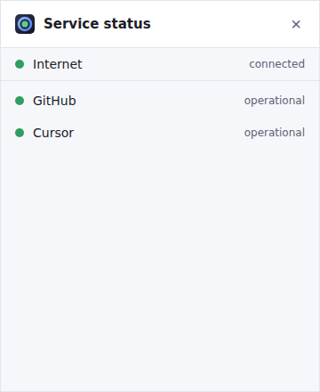
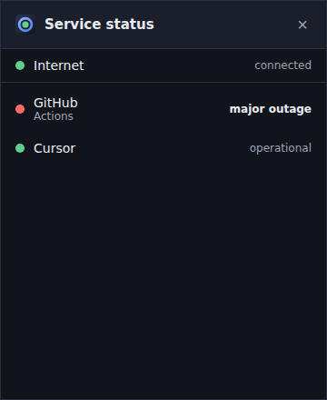
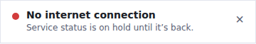
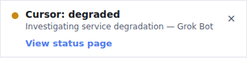

# App Status Tracker

A lightweight system-tray utility (Windows tray, macOS menu bar, Linux panel)
that watches the status pages of the services you depend on, such as
[GitHub](https://www.githubstatus.com) or [Cursor](https://status.cursor.com),
and turns them into one tray icon: green when everything is fine, the worst
current state when it isn't, and a notification only when something _changes_.

It is a sibling of [task-tracker](https://github.com/Djeisen642/task-tracker)
and borrows its stack, its tooling and its guardrails wholesale.

## Status

**Phase 1, in progress.** The app checks your internet connection and watches
**GitHub's** and **Cursor's** status pages, and pops up when any of them goes
bad. Adding your own services waits for the settings panel (phase 3). The plan, and what each phase delivers, is in
[`docs/future-work.md`](docs/future-work.md).

| All clear                                      | During an outage                                         |
| ---------------------------------------------- | -------------------------------------------------------- |
|  |  |

## Watching a status page

GitHub and Cursor are both watched through the Statuspage API
(`/api/v2/summary.json`), the same API a long tail of vendors serve, fetched
once a minute while you're online:

- **The panel** lists each service with its level; a service in trouble shows
  the incident, or which components are affected, under its name. Click a row
  to open that status page.
- **A bad state pops up** (see below), with a **View status page** link.
  Degraded performance, a partial outage and a major outage pop up; scheduled
  maintenance doesn't.
- **A status page that can't be read is "unknown", never green.** One failed
  fetch keeps the last reading; the second turns the service grey. It doesn't
  pop up: that's the app being blind, not the vendor being down.
- **While you're offline, services are "on hold"**, and only the connection
  pops up. Blaming GitHub for your Wi-Fi is what this whole app exists to avoid.

Every component on the page counts for now, and that is noisier than it
sounds: the Cursor capture below was taken while only **Grok Bot** was
degraded, which pops up "Cursor: degraded" for someone who only uses the IDE.
Choosing the components you care about is the fix; it is built and tested
(watching only IDE and CLI stays green through that incident) and waits for
the settings panel to have somewhere to live.

## The internet connection check

Every status page is useless while your own connection is down, and worse than
useless if a failed fetch is shown as a vendor's outage. So the app checks the
connection first, and everything else defers to it.

It sends a plain-HTTP request to two connectivity endpoints the OS vendors run
for exactly this job, `connectivitycheck.gstatic.com/generate_204` (Google) and
`www.msftconnecttest.com/connecttest.txt` (Microsoft), every 30 seconds while
online and every 5 to 10 seconds while in doubt:

| What it sees                                                  | What it says     |
| ------------------------------------------------------------- | ---------------- |
| Either endpoint answers exactly as expected                   | connected        |
| An answer that's wrong, or a redirect                         | sign-in required |
| Both fail twice in a row, or the OS reports no network at all | no connection    |

Plain HTTP is deliberate: a captive portal (hotel, airport, conference Wi-Fi)
can only intercept an unencrypted request, and intercepting one whose correct
answer is fixed is how it gets caught. One failed round is ignored, so a Wi-Fi
roam doesn't flicker the status.

## The popup

When a check goes bad, a small card appears in the top-right corner of your
largest screen:



- **It links to the page that explains it**: the status page for a service,
  or, on hotel or airport Wi-Fi, the sign-in page the network is holding you
  at. There's nothing to link to when you're simply offline.
- **It doesn't take your keyboard.** It shows up over whatever you're typing
  into and leaves the focus there.
- **It appears once per outage.** It closes itself when things recover. Close
  it with × and it stays closed until the next outage. A worse level or a new
  incident is a new outage.
- **It stays until you deal with it.** It doesn't fade out on a timer, because
  an outage matters most when you were away from the desk.
- **Click it to open the full panel.** It doesn't appear at all while the
  panel is already open.



That one is real: Cursor's status page as it was served on 25 September 2026.

## Tray menu

Left-click the icon to toggle the panel (or to grow a showing popup into it).
Right-click for the menu:

- a status line: "Offline: no internet connection" or "Offline: Wi-Fi sign-in
  required" when the connection is the problem, otherwise "GitHub
  operational" or the services in trouble, worst first (e.g. "GitHub: major
  outage")
- **Show status**, which opens the panel (the only way in on Linux, where most
  panels never deliver the icon's own click)
- **Quit**

The panel closes with Esc or its × button.

## Getting started

```bash
pnpm install          # deps + git hooks
pnpm run dev          # browser preview of the panel, no Rust needed
pnpm run tauri dev    # the real desktop app (needs the Rust toolchain)
```

If `pnpm` isn't on your PATH, `corepack enable && corepack prepare
pnpm@<pinned> --activate` installs exactly the version pinned by
`packageManager` in `package.json`.

On Linux, the webview and tray come from system libraries rather than the
bundle, so they have to be there before Rust will even compile:

```bash
sudo apt-get update && sudo apt-get install -y \
  libwebkit2gtk-4.1-dev libgtk-3-dev libayatana-appindicator3-dev \
  librsvg2-dev libsoup-3.0-dev libxdo-dev libssl-dev libdbus-1-dev \
  build-essential pkg-config file curl wget xdg-utils
```

Windows and macOS need no equivalent: WebView2 ships with Windows 11, and the
macOS webview is WebKit. macOS needs the Xcode command line tools
(`xcode-select --install`).

The dev server uses port **1440**, so it runs alongside task-tracker (1430) and
noticeable-calendar-alert (1420).

## Verifying it works

```bash
pnpm run check    # format, lint (type-aware), typecheck, version agreement, unit tests
pnpm run build    # it bundles
pnpm run e2e      # it runs: drives the real panel in a browser, captures screenshots
```

And in `src-tauri`: `cargo fmt --check`, `cargo clippy --all-targets -- -D
warnings`, `cargo check`, `cargo test`. CI runs all of it.

## Versioning

Exactly as in task-tracker: the version is derived from Conventional Commit
subjects by `scripts/version.ts`, enforced by a `commit-msg` hook, and written
into all four files that carry it (`package.json`, `src-tauri/tauri.conf.json`,
`src-tauri/Cargo.toml`, the crate's entry in `src-tauri/Cargo.lock`).

| Subject                             | Effect                  |
| ----------------------------------- | ----------------------- |
| `feat: …`                           | minor                   |
| `fix: …` / `perf: …`                | patch                   |
| `feat!: …`, or a `BREAKING CHANGE:` | minor while below 1.0.0 |
| anything else                       | no release on its own   |

The app starts at **0.1.0**, declared by hand and not yet tagged, so the first
green CI run on `main` tags `v0.1.0` as itself. 1.0 is a decision for a person to
make, not something the tooling will promote the app to.

`.github/workflows/release.yml` tags and publishes after CI passes on `main`. It
pushes as `github-actions[bot]`, so a branch protection rule on `main` needs an
exception for it.

```bash
pnpm run version:check       # do the four files agree?
pnpm run version:next        # what would the next version be, and why
pnpm run version:sync 0.2.0  # write a number into all four files
```

## Stack

Tauri v2, vanilla TypeScript and Vite. No UI framework: the app runs all day,
so idle memory matters.

## License

MIT
