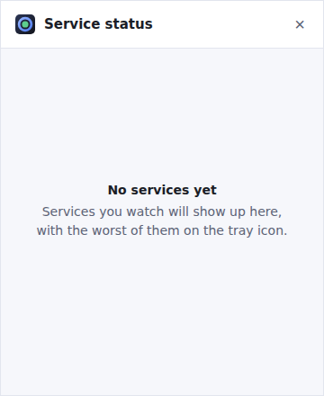
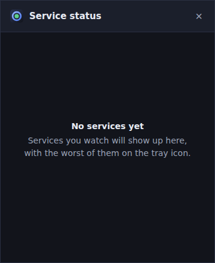

# App Status Tracker

A lightweight system-tray utility (Windows tray, macOS menu bar, Linux panel)
that watches the status pages of the services you depend on, such as
[GitHub](https://www.githubstatus.com) or [Cursor](https://status.cursor.com),
and turns them into one tray icon: green when everything is fine, the worst
current state when it isn't, and a notification only when something _changes_.

It is a sibling of [task-tracker](https://github.com/Djeisen642/task-tracker)
and borrows its stack, its tooling and its guardrails wholesale.

## Status

**Phase 0: the scaffold.** The app builds, starts, puts an icon in the tray and
opens an empty panel. It does not fetch anything yet. The plan, and what each
phase delivers, is in [`docs/future-work.md`](docs/future-work.md).

| Light                                                   | Dark                                                  |
| ------------------------------------------------------- | ----------------------------------------------------- |
|  |  |

## Tray menu

Left-click the icon to toggle the panel. Right-click for the menu:

- a status line (currently always "No services yet")
- **Show status**, which opens the panel (the only way in on Linux, where most
  panels never deliver the icon's own click)
- **Quit**

The panel closes with Esc or its × button.

## Getting started

```bash
pnpm install          # deps + git hooks
pnpm run dev          # browser preview of the panel, no Rust needed
pnpm run tauri dev    # the real desktop app (needs the Rust toolchain)
```

If `pnpm` isn't on your PATH, `corepack enable && corepack prepare
pnpm@<pinned> --activate` installs exactly the version pinned by
`packageManager` in `package.json`.

On Linux, the webview and tray come from system libraries rather than the
bundle, so they have to be there before Rust will even compile:

```bash
sudo apt-get update && sudo apt-get install -y \
  libwebkit2gtk-4.1-dev libgtk-3-dev libayatana-appindicator3-dev \
  librsvg2-dev libsoup-3.0-dev libxdo-dev libssl-dev libdbus-1-dev \
  build-essential pkg-config file curl wget xdg-utils
```

Windows and macOS need no equivalent: WebView2 ships with Windows 11, and the
macOS webview is WebKit. macOS needs the Xcode command line tools
(`xcode-select --install`).

The dev server uses port **1440**, so it runs alongside task-tracker (1430) and
noticeable-calendar-alert (1420).

## Verifying it works

```bash
pnpm run check    # format, lint (type-aware), typecheck, version agreement, unit tests
pnpm run build    # it bundles
pnpm run e2e      # it runs: drives the real panel in a browser, captures screenshots
```

And in `src-tauri`: `cargo fmt --check`, `cargo clippy --all-targets -- -D
warnings`, `cargo check`, `cargo test`. CI runs all of it.

## Versioning

Exactly as in task-tracker: the version is derived from Conventional Commit
subjects by `scripts/version.ts`, enforced by a `commit-msg` hook, and written
into all four files that carry it (`package.json`, `src-tauri/tauri.conf.json`,
`src-tauri/Cargo.toml`, the crate's entry in `src-tauri/Cargo.lock`).

| Subject                             | Effect                  |
| ----------------------------------- | ----------------------- |
| `feat: …`                           | minor                   |
| `fix: …` / `perf: …`                | patch                   |
| `feat!: …`, or a `BREAKING CHANGE:` | minor while below 1.0.0 |
| anything else                       | no release on its own   |

The app starts at **0.1.0**, declared by hand and not yet tagged, so the first
green CI run on `main` tags `v0.1.0` as itself. 1.0 is a decision for a person to
make, not something the tooling will promote the app to.

`.github/workflows/release.yml` tags and publishes after CI passes on `main`. It
pushes as `github-actions[bot]`, so a branch protection rule on `main` needs an
exception for it.

```bash
pnpm run version:check       # do the four files agree?
pnpm run version:next        # what would the next version be, and why
pnpm run version:sync 0.2.0  # write a number into all four files
```

## Stack

Tauri v2, vanilla TypeScript and Vite. No UI framework: the app runs all day,
so idle memory matters.

## License

MIT
